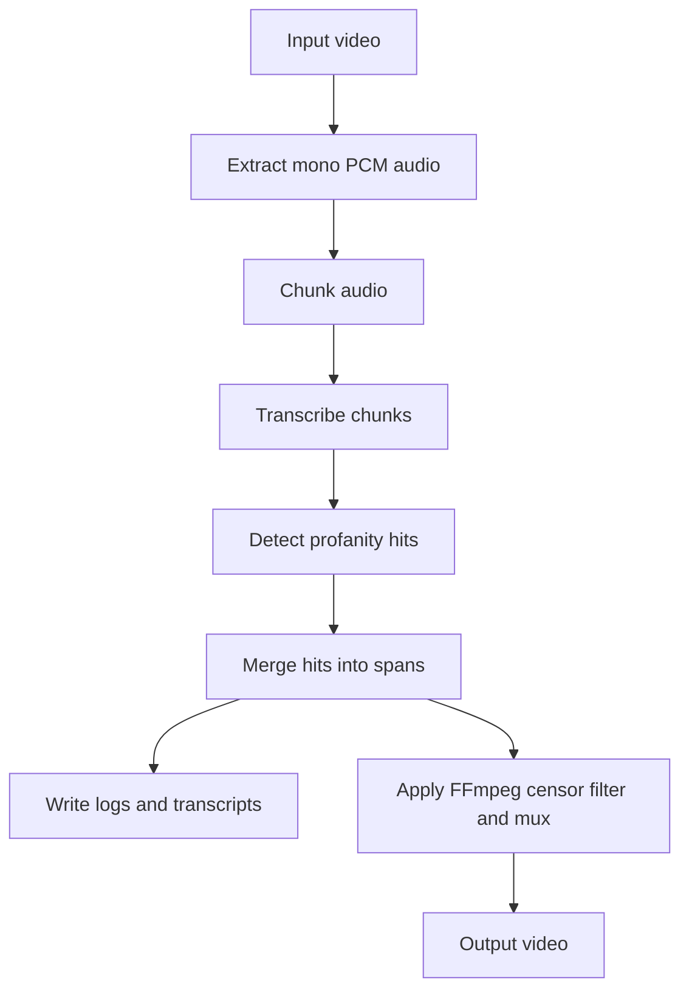

# AGENTS.md

High-signal handoff notes for contributors and operators of `profanity_remover`.

Primary references:

- User-facing overview and CLI examples: [`README.md`](README.md:1)
- CLI entrypoint + end-to-end pipeline: [`src/main.py`](src/main.py:1)
- Configuration and env var parsing: [`src/config.py`](src/config.py:1)
- Data models: [`src/domain.py`](src/domain.py:1)
- Transcription orchestration: [`src/transcriber.py`](src/transcriber.py:1)
- Profanity detection + span merging + logs/subtitles: [`src/profanity_detector.py`](src/profanity_detector.py:1)
- Audio extraction + chunking: [`src/audio_tools.py`](src/audio_tools.py:1)
- FFmpeg mux/censor filters: [`src/video_tools.py`](src/video_tools.py:1)

## Project purpose

This project takes an input video file, transcribes its primary audio track, detects profanities, and produces an output video where profanity spans are censored.

Two censoring modes are supported:

- `mute`: silence profanity spans via FFmpeg volume filters.
- `bleep`: overlay a synthetic 1 kHz sine tone over profanity spans via FFmpeg filter graph.

## High-level pipeline flow

The end-to-end flow is implemented in [`src/main.py:run_pipeline()`](src/main.py:141).



Key details:

- Audio extraction uses `ffmpeg` in [`src/audio_tools.py:extract_mono_pcm_audio()`](src/audio_tools.py:19).
- Chunking is WAV-based in [`src/audio_tools.py:chunk_audio()`](src/audio_tools.py:70) and skips very short tail chunks to avoid API errors.
- Transcription runs per chunk and aggregates to absolute timestamps in [`src/transcriber.py:_parse_transcript_response()`](src/transcriber.py:60).
- Profanity is detected primarily via word-level timing tokens in [`src/profanity_detector.py:detect_profanity()`](src/profanity_detector.py:39).
- Hits are merged into continuous spans via [`src/profanity_detector.py:merge_profanity_spans()`](src/profanity_detector.py:147).
- Final muxing/censoring is done with FFmpeg in [`src/video_tools.py:apply_audio_filters_and_mux()`](src/video_tools.py:266).

## Environment setup

### Python environment

From repo root:

```bash
python3 -m venv .venv
source .venv/bin/activate
pip install -r requirements.txt
```

Dependencies are declared in [`requirements.txt`](requirements.txt:1).

### External tools

- `ffmpeg` must be installed and available on `PATH` (used by [`src/audio_tools.py:extract_mono_pcm_audio()`](src/audio_tools.py:19) and [`src/video_tools.py:apply_audio_filters_and_mux()`](src/video_tools.py:266)).
- `ffprobe` must be installed and available on `PATH` (used by [`src/video_tools.py:probe_primary_audio_codec_and_bitrate()`](src/video_tools.py:102)).

Platform guidance:

- macOS/Linux only (per [`README.md`](README.md:15)).

## Running the app

The CLI entrypoint is [`src/main.py:main()`](src/main.py:229). It is typically run as a module:

```bash
python -m src.main --input movie.mp4 --output out/safe.mp4 --mode mute
```

For a fuller example, see [`README.md`](README.md:81).

### Inputs

- `--input` (`-i`): path to a video file (the help text references MP4/MKV/AVI in [`src/main.py:parse_args()`](src/main.py:29)).
- `--output` (`-o`): output video path.

### Outputs

Produced under the configured output directory (default: `out`):

- [`transcript.json`](src/main.py:147) written by [`src/transcriber.py:save_transcript_json()`](src/transcriber.py:308)
- [`censor_log.json`](src/main.py:148) written by [`src/profanity_detector.py:build_censor_log()`](src/profanity_detector.py:196)
- Optional [`transcript_clean.txt`](src/main.py:149) (masked) built by [`src/transcriber.py:build_clean_transcript()`](src/transcriber.py:329)
- Optional [`censored_subtitles.srt`](src/main.py:150) built by [`src/profanity_detector.py:build_subtitles()`](src/profanity_detector.py:255)
- Optional [`out/audio_debug/`](src/main.py:169) with extracted audio + chunk WAVs when `DEBUG_DUMP_AUDIO=true` or `--debug-dump-audio` (see [`src/main.py:run_pipeline()`](src/main.py:141)).

The cleaned output video is always written to `--output`.

## Configuration

Configuration is merged in the order:

1) CLI args
2) Environment variables
3) Defaults

This is implemented in [`src/config.py:_coalesce()`](src/config.py:136) and applied in [`src/config.py:load_config_from_args()`](src/config.py:187).

### .env support

The app loads a repo-root [`.env`](src/config.py:193) file if present (and otherwise falls back to [`src/.env`](src/config.py:194) as legacy) in [`src/config.py:load_config_from_args()`](src/config.py:187).

Template environment file: [`.env.example`](.env.example:1).

### Environment variables

All env vars currently read by the app are documented in [`.env.example`](.env.example:1) and parsed in [`src/config.py:load_config_from_args()`](src/config.py:187).

Notable details:

- Boolean env vars are strict: only `true`/`false` (case-insensitive) are accepted in [`src/config.py:_parse_bool()`](src/config.py:76).
- Note: [`.env.example`](.env.example:58) currently claims `1/0`, `yes/no`, `on/off` are accepted, but the implementation rejects them; see [`tests/test_config_env.py`](tests/test_config_env.py:70).
- Backend selector is strict: only `local_whisper` or `openai_api` in [`src/config.py:_parse_whisper_backend()`](src/config.py:87).

Key variables:

- `WHISPER_BACKEND`: `local_whisper` or `openai_api`.
- `OPENAI_API_KEY`: required only for the `openai_api` backend.
- `WHISPER_MODEL`: model name (interpretation depends on backend; see below).
- `MODE`: `mute` or `bleep`.
- `AUDIO_LANGUAGE`: ISO-ish language code passed to STT.
- `CHUNK_LENGTH_SECONDS`, `MIN_CONFIDENCE`, `MAX_GAP_COMBINE_MS`.
- `OUTPUT_DIR`.
- `PROFANITY_LIST`: optional path to a profanity list file.

### Profanity list: where it lives and formats

Default profanity terms for English are loaded from [`config/profanity_en.txt`](config/profanity_en.txt:1) via [`src/config.py:load_default_profanity_list()`](src/config.py:165).

If a custom profanity list is provided:

- CLI flag `--profanity-list` is defined in [`src/main.py:parse_args()`](src/main.py:29).
- Env var `PROFANITY_LIST` is read in [`src/config.py:load_config_from_args()`](src/config.py:187).

Supported file formats (per implementation in [`src/config.py:load_config_from_args()`](src/config.py:187)):

- JSON: a list of strings.
- Text: one term per line; blank lines and `#` comments are ignored.

Note: [`README.md`](README.md:98) and the CLI help text in [`src/main.py:parse_args()`](src/main.py:44) describe JSON, but the config loader supports both JSON and text formats.

### Switching transcription backend (local Whisper vs OpenAI API)

Backend implementations:

- Local inference: [`src/transcription_backends/local_whisper.py`](src/transcription_backends/local_whisper.py:1)
- OpenAI API: [`src/transcription_backends/openai_api.py`](src/transcription_backends/openai_api.py:1)

Selection is currently env-driven via `WHISPER_BACKEND` (see [`.env.example`](.env.example:15) and [`src/config.py:load_config_from_args()`](src/config.py:187)).

Verify: there is no `--whisper-backend` CLI flag defined in [`src/main.py:parse_args()`](src/main.py:29); backend switching appears to be env-only.

#### Whisper model selection and normalization

The user-facing model name is taken from `--whisper-model` / `WHISPER_MODEL` and normalized per backend in [`src/transcriber.py:_normalize_model_for_backend()`](src/transcriber.py:24).

Behavior:

- If `WHISPER_BACKEND=local_whisper` and the user provides `whisper-1`, it is translated to `base`.
- If `WHISPER_BACKEND=openai_api` and the user provides `tiny/base/small/medium/large`, it is translated to `whisper-1`.

Operational note: [`src/transcriber.py:transcribe_chunk()`](src/transcriber.py:151) uses `response_format=verbose_json` and warns that some OpenAI models may not support it.

## Architecture (modules and responsibilities)

### Configuration

- Data container: [`src/config.py:AppConfig`](src/config.py:16)
- Parsing/merging: [`src/config.py:load_config_from_args()`](src/config.py:187)

### Domain models

All cross-module data shapes live in [`src/domain.py`](src/domain.py:1):

- Transcript data: [`src/domain.py:TranscriptWord`](src/domain.py:13), [`src/domain.py:TranscriptSegment`](src/domain.py:23), [`src/domain.py:TranscriptionResult`](src/domain.py:36)
- Profanity data: [`src/domain.py:ProfanityTerm`](src/domain.py:54), [`src/domain.py:ProfanityHit`](src/domain.py:71), [`src/domain.py:ProfanitySpan`](src/domain.py:86)

Note: [`src/domain.py:ProfanityTerm.pattern`](src/domain.py:60) centralizes word-boundary matching as a domain behavior.

### Transcription

- Parallel chunk transcription and aggregation: [`src/transcriber.py:transcribe_audio_chunks()`](src/transcriber.py:251)
- Per-chunk retries and backend dispatch: [`src/transcriber.py:transcribe_chunk()`](src/transcriber.py:151)
- Transcript JSON persistence: [`src/transcriber.py:save_transcript_json()`](src/transcriber.py:308)

Backend notes:

- Local Whisper caches models and serializes transcribe calls per model name (thread safety) in [`src/transcription_backends/local_whisper.py:transcribe_audio()`](src/transcription_backends/local_whisper.py:125).
- OpenAI API client is constructed lazily in [`src/transcription_backends/openai_api.py:get_client()`](src/transcription_backends/openai_api.py:15).

### Profanity detection

- Term loading: [`src/profanity_detector.py:load_profanity_terms()`](src/profanity_detector.py:22)
- Detection: [`src/profanity_detector.py:detect_profanity()`](src/profanity_detector.py:39)
- Span merge: [`src/profanity_detector.py:merge_profanity_spans()`](src/profanity_detector.py:147)
- JSON log output: [`src/profanity_detector.py:build_censor_log()`](src/profanity_detector.py:196)
- Subtitle generation: [`src/profanity_detector.py:build_subtitles()`](src/profanity_detector.py:255)

Important behavior: in mute mode, low-confidence matched profanity tokens are retained to preserve timestamp alignment (see [`src/profanity_detector.py:detect_profanity()`](src/profanity_detector.py:39) and the regression test in [`tests/test_profanity_detector.py`](tests/test_profanity_detector.py:73)).

### Media processing

- Audio extraction: [`src/audio_tools.py:extract_mono_pcm_audio()`](src/audio_tools.py:19)
- Chunking: [`src/audio_tools.py:chunk_audio()`](src/audio_tools.py:70)
- FFmpeg filters and mux: [`src/video_tools.py:apply_audio_filters_and_mux()`](src/video_tools.py:266)

Muxing strategy when spans exist:

- Only the primary audio stream `0:a:0` is re-encoded; video is stream-copied and other audio tracks are preserved (see [`src/video_tools.py:_build_ffmpeg_censor_and_mux_cmd()`](src/video_tools.py:182) and [`tests/test_video_tools.py`](tests/test_video_tools.py:39)).

## Testing

Run tests:

```bash
pytest
```

Pytest configuration and markers are in [`pytest.ini`](pytest.ini:1):

- `integration`: end-to-end-ish tests that patch external calls.
- `manual`: tests that call real external services (OpenAI/ffmpeg) and must be run explicitly.

Important tests to understand the system:

- Full pipeline wiring with patched FFmpeg/OpenAI: [`tests/test_integration.py`](tests/test_integration.py:1)
- Config/env precedence and validation: [`tests/test_config_env.py`](tests/test_config_env.py:1)
- Local Whisper concurrency serialization: [`tests/test_local_whisper_concurrency.py`](tests/test_local_whisper_concurrency.py:1)
- FFmpeg filter/mux contract: [`tests/test_video_tools.py`](tests/test_video_tools.py:1)
- Profanity detection behavior: [`tests/test_profanity_detector.py`](tests/test_profanity_detector.py:1)

Note: [`README.md`](README.md:124) references `tests/test_core.py`, but this repository currently contains multiple focused test modules under [`tests/`](tests:1).

### Adding tests

Recommended patterns (as used in the existing suite):

- Prefer unit tests over end-to-end media tests by patching FFmpeg and transcription functions (see [`tests/test_integration.py:_patch_pipeline()`](tests/test_integration.py:76)).
- Use small synthetic dataclass objects from [`src/domain.py`](src/domain.py:1) for deterministic behavior.

## Common dev/operator tasks

### Add a profanity term

Preferred (default English list):

- Add a new line to [`config/profanity_en.txt`](config/profanity_en.txt:1).

Custom list (per run or per environment):

- Point `PROFANITY_LIST` (or `--profanity-list`) at a JSON list or a text file (see [`src/config.py:load_config_from_args()`](src/config.py:187)).

### Tune censoring aggressiveness

- Increase/decrease merge window: `MAX_GAP_COMBINE_MS` used by [`src/profanity_detector.py:merge_profanity_spans()`](src/profanity_detector.py:147).
- Adjust confidence filtering: `MIN_CONFIDENCE` used by [`src/profanity_detector.py:detect_profanity()`](src/profanity_detector.py:39).
  - Note: mute mode retains low-confidence hits for timing alignment.

### Adjust timestamps and edge coverage

Mute mode adds an end padding constant to ensure trailing consonants are covered:

- [`src/video_tools.py:MUTE_END_PADDING_SEC`](src/video_tools.py:18)

If censoring feels late/early, investigate:

- Transcript word timestamps emitted by STT (see [`src/transcriber.py:save_transcript_json()`](src/transcriber.py:308)).
- Chunk boundary handling and absolute time conversion (see [`src/transcriber.py:_parse_transcript_response()`](src/transcriber.py:60)).

### Troubleshoot transcription failures

Typical levers:

- Enable verbose logging: `--verbose` / `VERBOSE` (see [`src/main.py:setup_logging()`](src/main.py:132)).
- Dump audio and chunk WAVs: `--debug-dump-audio` / `DEBUG_DUMP_AUDIO` (see [`src/main.py:run_pipeline()`](src/main.py:141)).
- Reduce chunk size: `CHUNK_LENGTH_SECONDS` (shorter chunks can reduce timeout/latency issues but increase overhead).
- Set explicit language: `AUDIO_LANGUAGE` (passed through to both backends).
- Pick a different model: `WHISPER_MODEL` / `--whisper-model`.

OpenAI API specifics:

- Ensure `OPENAI_API_KEY` is set (see [`src/transcription_backends/openai_api.py:get_client()`](src/transcription_backends/openai_api.py:15)).
- If you see 400 errors about `response_format`, use a model that supports `verbose_json` (see the note in [`src/transcriber.py:transcribe_chunk()`](src/transcriber.py:151)).
- If you see 429 rate limits, consider reducing concurrency (verify: concurrency is currently selected internally in [`src/transcriber.py:transcribe_audio_chunks()`](src/transcriber.py:251) and is not exposed as a CLI flag).

Local Whisper specifics:

- The backend intentionally serializes `model.transcribe` per model name to avoid thread-safety issues (see [`src/transcription_backends/local_whisper.py`](src/transcription_backends/local_whisper.py:16) and [`tests/test_local_whisper_concurrency.py`](tests/test_local_whisper_concurrency.py:1)).

### Performance and concurrency notes

- Chunk transcription uses a thread pool with an internal heuristic up to 8 workers in [`src/transcriber.py:transcribe_audio_chunks()`](src/transcriber.py:251).
- Local Whisper will not fully parallelize transcription for a single model name due to per-model serialization.
- OpenAI API backend can parallelize chunk uploads/transcriptions, but you may hit network/API rate limits.

## Coding conventions and patterns

Observed patterns (no separate linter/formatter config found; verify if you add one):

- Dataclasses for domain and configuration objects (see [`src/config.py:AppConfig`](src/config.py:16) and [`src/domain.py`](src/domain.py:1)).
- Typed literals for narrow config values (see [`src/config.py:Mode`](src/config.py:11) and [`src/config.py:WhisperBackend`](src/config.py:13)).
- Errors are generally raised with clear messages; the CLI catches exceptions at top-level and returns non-zero (see [`src/main.py:main()`](src/main.py:229)).

## Safety and operational notes

- Media files can be large; the pipeline extracts audio and creates chunk WAVs in a temp directory (see [`src/main.py:run_pipeline()`](src/main.py:141)). Use `--debug-dump-audio` cautiously because it persists audio to disk.
- When using `WHISPER_BACKEND=openai_api`, chunk audio is sent to OpenAI. Ensure this matches your privacy requirements.
- Store secrets in [`.env`](src/config.py:193) (not checked in) using the template [`.env.example`](.env.example:1). Do not commit real keys.
- Be mindful of OpenAI API rate limits and costs when transcribing long content; retries are implemented in [`src/transcriber.py:transcribe_chunk()`](src/transcriber.py:151) but are generic (exception-based) rather than rate-limit-aware.
